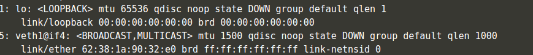
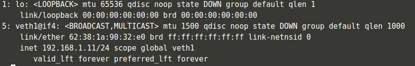
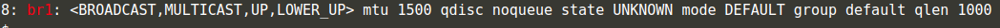
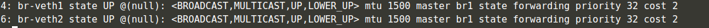
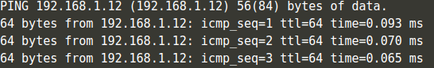
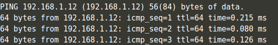
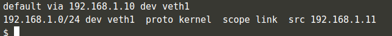
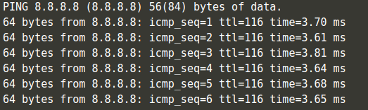

# Namespacelab

First we will create 2 namespace.

```bash
ip netns add namespace1
ip netns add namespace2
```


We can verify that inside the namespace, only the loopback interface has been set.

```bash
ip netns exec namespace1 \
        ip address show
```

<br> 
 <br> <br>

At this point, we can start creating the veth pairs and associating one of their sides to their respective namespaces.

```bash
# Create the two pairs.
ip link add veth1 type veth peer name br-veth1
ip link add veth2 type veth peer name br-veth2

# Associate the non `br-` side
# with the corresponding namespace
ip link set veth1 netns namespace1
ip link set veth2 netns namespace2
```
Now  the namespaces have an additional interface.

```bash
ip netns exec namespace1 \
        ip address show
```

<br> 
 <br> <br>


Let assign IP address to the veth interfaces.

```bash
ip netns exec namespace1 \
        ip addr add 192.168.1.11/24 dev veth1

ip netns exec namespace2 \
        ip addr add 192.168.1.12/24 dev veth2

ip netns exec namespace1 \
        ip address show


```
<br> 
 <br> <br>


Although we have both IPs and interfaces set, we can’t establish communication with them.

That’s because there’s no interface in the default namespace that can send the traffic to those namespaces.

With the creation of the bridge device, we’re then able to provide the necessary routing, properly forming the network.


```bash
ip link add name br1 type bridge
ip link set br1 up

```

Confirming that the device is created.
```bash
ip link | grep br1
```

<br> 
 <br> <br>

With the bridge created, now it’s time to connect the bridge-side of the veth pair to the bridge device.
Set the bridge veths from the default namespace up.

```bash
ip link set br-veth1 up
ip link set br-veth2 up
```
Set the veths from the namespaces up too.
```bash

ip netns exec namespace1 \
        ip link set veth1 up
ip netns exec namespace2 \
        ip link set veth2 up

```

Add the br-veth interfaces to the bridge by setting the bridge device as their master.

```bash
ip link set br-veth1 master br1
ip link set br-veth2 master br1
```
Check that the bridge is the master of the two interfaces that we set.

```bash
bridge link show br1
```

<br> 
 <br> <br>

Now, it’s a matter of giving this bridge device an address so that we can target such IP in our machine’s routing table making it a target for connections to those interfaces that we added to it.

```bash


ip addr add 192.168.1.10/24 brd + dev br1
```
We can verify that we indeed have connectivity:
```bash
# Check the connectivity from the default namespace (host)
ping 192.168.1.12

```
<br> 
 <br> <br>

We can also reach the interface of the other namespace given that we have a route to it.

```bash

ip netns exec namespace1\
        ip route
```
<br> 
 <br> <br>

Let's reach the other then iface then.
```bash
ip netns exec namespace1 \
        ping 192.168.1.12
```
<br> 
 <br> <br>

```bash
# Try to reach Google's DNS servers (8.8.8.8) from namespace1.

ip netns exec namespace1 \
        ping 8.8.8.8
```
<br> 
 <br> <br>

Given that the routing table from namespace1 doesn’t have a default gateway, it can’t reach any other machine from outside the 
192.168.1.0/24 range.

To fix that, the first step is giving the namespaces a default gateway route. 192.168.1.10 corresponds to the address assigned to the bridge device - reachable from both namespaces, as well as the host machine.
```bash
ip -all netns exec \
        ip route add default via 192.168.1.10
```
Let verify it.
```bash
ip netns exec namespace1 \
        ip route
```
<br> 
 <br> <br>

Let try to reach Google's DNS servers (8.8.8.8) now .
```bash
ip netns exec namespace1 \
        ping 8.8.8.8  
```
<br> 
 <br> <br>

Although the network is now reachable, there’s no way that we can have responses back - packets from external networks can’t be sent directly to our 192.168.1.0/24 network.

To get around that, we can make use of NAT (network address translation) by placing an iptables rule in the POSTROUTING chain of the nat table.

```bash
# iptables is the command line utility for configuring the kernel

# -t specifies the table to which the commands should be directed to. By default it's `filter`

# -t nat select table "nat" for configuration of NAT rules.

# -A specifies that we're appending a rule to the chain the we tell the name after it

# -A POSTROUTING - Append a rule to the POSTROUTING chain

# -s specifies a source address

# -j specifies the target to jump to (what action to take)

#-j MASQUERADE - the action that should take place is to 'masquerade' packets, i.e. replacing the sender's address by the router's address

iptables \
        -t nat \
        -A POSTROUTING \
        -s 192.168.1.0/24 \
        -j MASQUERADE
```
Now everything is configured.

```bash
# Try to reach Google's DNS servers (8.8.8.8) from namespace1

   ip netns exec namespace1 ping 8.8.8.8   
```

<br> 
 <br> <br>


# Deep dive into ```ip route``` command

```bash
ip netns exec namespace1 \
        ip route
```
<br> 
 <br> <br>

Let's interpret the output above.
The first line says that the default route for any packet (i.e., the route which is taken by a packet when no other route applies) is through the network device veth1 via the default gateway (the bridge) which has the IP address 192.168.1.10

 The second line says that packets sent to any IP address within the subnetwork 192.168.1.0/24 must be sent through the network interface veth1 with 192.168.1.11 as the source IP address, which in this case is the IP address assigned to veth1. 
 
 "proto kernel" means this entry in the routing table was created by the kernel during autoconfiguration . It is a route added automatically when you assign an address to an interface. Lets say in this case, we assigned an address 192.168.1.11/24 to veth1 , kernel automatically adds route to whole subnet via this interface during auto-configuration.

The scope of a route in Linux is an indicator of the distance to the
destination network. There can be 3 types of scope.

Host - A route has host scope when it leads to a destination address on the local host.

Link - A route has link scope when it leads to a destination address on the local network.

Universe(Global) - A route has universe scope when it leads to addresses more than one hop away.

In the example scope link means that within the network segment
(192.168.1.0/24) of the device communication is allowed through this link.

# Assigning 192.168.1.10/32 to any interface

There is only 1 IP address in 192.168.1.10/32. So there can be no other host in this network. Even there is no room for a default gateway IP address to get to other networks. So /32 is not used.